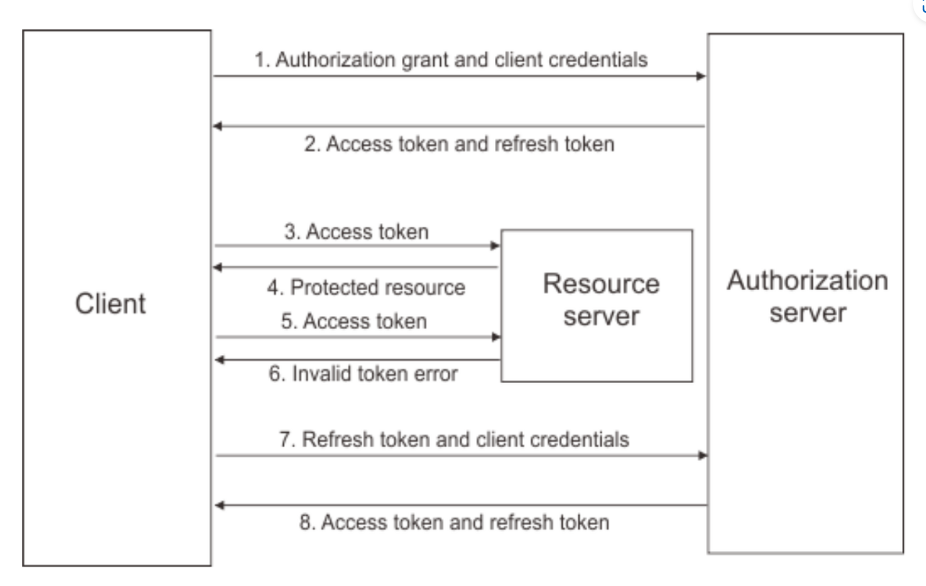

# LOGIN & REGISTER
### 협업 프로젝트 작성

### TUTORIAL
#### 구현방식 : 
1. Spring Security
   - 스프링 기반의 어플리케이션에서 보안을 위해 인증과 권한 부여를 사용해 접근 제어하는 프레임워크
2. OAuth
   
   - 출처 : https://gdtbgl93.tistory.com/180
   - 
### LOGIN

### REGISTER
